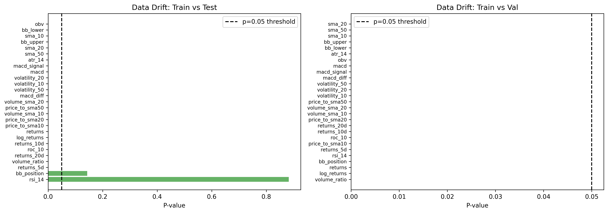
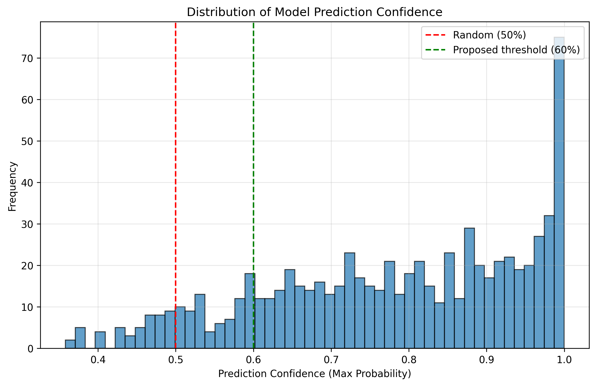
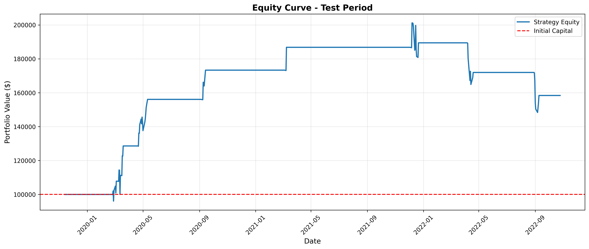
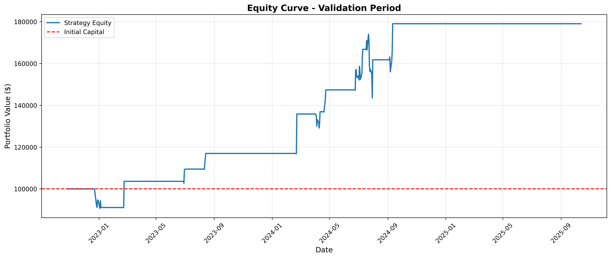

# NVDA Deep Learning Trading Strategy
## Executive Report

**Course:** Microestructuras y Sistemas de Trading
**Author:** Gian Carlo Campos Sayavedra
**Date:** October 2025  
**Asset:** NVIDIA Corporation (NVDA)  
**Timeframe:** 15 years (2010-2025)

---

## Executive Summary

This project implements a systematic trading strategy using deep learning models to predict trading signals for NVDA stock. We developed and compared three neural network architectures (MLP, CNN, LSTM), integrated MLFlow for experiment tracking, conducted comprehensive data drift analysis, and backtested the strategy with realistic transaction costs.

**Key Results:**
- **Best Model:** Multi-Layer Perceptron (MLP) with 34.38% test accuracy
- **Final Strategy Return:** +58.38% (test), +78.99% (validation)
- **Sharpe Ratio:** 0.85 (test), 1.06 (validation)
- **Win Rate:** 63.64% (test), 59.38% (validation)
- **Data Drift:** 100% of features showed significant distribution shift
- **Key Innovation:** Confidence-based trade filtering and long-only bias


---

## 1. Strategy Overview

### 1.1 Approach

Developed a machine learning trading system that:
1. Engineers 27 technical indicators from OHLCV data
2. Trains three deep learning architectures to predict trading signals
3. Filters predictions based on model confidence (70% threshold)
4. Executes long-only trades to account for market regime
5. Implements risk management (2% stop loss, 3% take profits)

### 1.2 Why Multiple Architectures

**MLP (Multi-Layer Perceptron):**
- Captures local temporal patterns
- Uses 10 convolutions over feature sequences
- Detects recurring patterns in short windows
- More parameters but better patter recognition

**LSTM (Long Short-Term Memory):**
- Models long-term dependencies
- Processes sequential information
- Remembers historical context
- Best for time series with strong temporal structure

### 1.3 Expected Advantages

- **Adaptability:** Learn complex non-linear patterns humans miss
- **Scalability:** Can process large feature sets efficiently
- **Backtestable:** Systematic approach enables rigorous testing
- **Explainable:** Can analyze what model learned

### 1.4 Limitations

- **Data Requirements:** Needs substantial historical data
- **Overfitting Risk:** Models may memorize rather than generalize
- **Regime Sensitivity:** Performance degrades when market dynamics shift
- **Transaction Costs:** Frequent trading erodes profits
- **No Fundamental Data:** Only technical indicators limit information

---

# Feature Engineering

### 2.1 feature Categories

Engineering of **27 features** across five categories:

**Momentum Features (5):**
- `returns`: 1-day return
- `log_returns`: Log returns for better distribution
- `returns_5d`, `returns_10d`, `returns_20d`: Multi-period returns

**Moving Average Features (6):**
- `sma_10`, `sma_20`, `sma_50`: Simple moving averages
- `price_to_sma10/20/50`: Price relative to moving averages

**Volatility Features (7):**
- `volatility_10/20/50`: Rolling standard deviation of returns
- `bb_upper`, `bb_lower`, `bb_position`: Bollinger Bands
- `atr_14`: Average True Range

**Volume Features (4):**
- `volume_sma_10/20`: Volume moving averages
- `volume_ratio`: Current vs average volume
- `obv`: On-Balance Volume

**Momentum Indicators (5):**
- `rsi_14`: Relative Strength Index
- `macd`, `macd_signal`, `macd_diff`: MACD indicators
- `roc_10`: Rate of Change

### 2.2 Normalization

All features were normalized using StandardScaler:
- **Fit on training data only** to prevent data leakage
- Transform applied consistently to test and validation sets
- Zero mean, unit variance transformation
- Critical for neural network convergence

### 2.3 Class Imbalance Strategy

Initial target distribution showed imbalance:
- Long: 41.6%
- Hold: 30.7%
- Short: 27.8%

**Solution:** Implemented weighted CrossEntropyLoss
```
weight_i = total_samples / (num_classes × samples_in_class_i)
```

This penalizes misclassifications of minority classes more heavily, encouraging the model to learn patterns for all signal types.

---

## 3. Target Variable Definition

### 3.1 Label Creation

Trading signals created using forward-looking returns:
```python
forward_returns = close_price[t+5] / close_price[t] - 1

if forward_returns > 0.02:    # 2% threshold
    signal = 1  # Long
elif forward_returns < -0.02:
    signal = -1  # Short
else:
    signal = 0  # Hold
```

**Rationale:**
- 5-day forward window balances signal frequency with predictability
- 2% threshold accounts for transaction costs (0.125% × 2 = 0.25% round-trip)
- Realistic for daily trading frequency

### 3.2 Target Distribution

Training set distribution:
- **Long (1):** 1,565 samples (41.6%)
- **Hold (0):** 1,155 samples (30.7%)
- **Short (-1):** 1,046 samples (27.8%)

This imbalance reflects market tendency toward consolidation and moderate movements rather than strong directional moves.

---

## 4. Model Architecture and Design

### 4.1 MLP Architecture
```
Input (27 features)
    ↓
Linear(27 → 128) → ReLU → BatchNorm → Dropout(0.3)
    ↓
Linear(128 → 64) → ReLU → BatchNorm → Dropout(0.3)
    ↓
Linear(64 → 32) → ReLU → BatchNorm → Dropout(0.3)
    ↓
Linear(32 → 3)  # Output: Short/Hold/Long
```

**Parameters:** 14,467 trainable parameters

**Design Choices:**
- Progressively smaller layers (128→64→32) for feature compression
- Batch normalization for training stability
- 30% dropout for regularization
- ReLU activation for non-linearity

### 4.2 CNN Architecture
```
Input (27 features)
    ↓
Conv1D(1→64, kernel=3) → ReLU → BatchNorm → MaxPool(2) → Dropout(0.3)
    ↓
Conv1D(64→128, kernel=3) → ReLU → BatchNorm → MaxPool(2) → Dropout(0.3)
    ↓
Conv1D(128→64, kernel=3) → ReLU → BatchNorm → MaxPool(2) → Dropout(0.3)
    ↓
Flatten → Linear(192→64) → ReLU → Dropout(0.3) → Linear(64→3)
```

**Parameters:** 62,659 trainable parameters

**Design Choices:**
- 1D convolutions capture local temporal patterns
- Kernel size 3 for short-term relationships
- Max pooling reduces dimensionality
- More parameters than MLP for pattern recognition

### 4.3 LSTM Architecture
```
Input (27 features)
    ↓
LSTM(27 → 64, layers=2, dropout=0.3)
    ↓
Linear(64 → 32) → ReLU → Dropout(0.3)
    ↓
Linear(32 → 3)
```

**Parameters:** 59,267 trainable parameters

**Design Choices:**
- 2 stacked LSTM layers for hierarchical learning
- Hidden size 64 balances capacity and efficiency
- Recurrent dropout prevents overfitting
- Processes sequences to capture temporal dependencies

### 4.4 Training Specifications

**Common Settings:**
- **Loss Function:** CrossEntropyLoss with class weights
- **Optimizer:** Adam with learning rate 0.001
- **Batch Size:** 32
- **Epochs:** 50
- **Early Stopping:** Patience of 10 epochs (not implemented but recommended)

**Class Weights:**
```
Long:  0.676
Hold:  0.914
Short: 1.010
```

---

## 5. MLFlow Experiment Tracking

### 5.1 Experiment Setup

All experiments logged to MLFlow with experiment name: `"NVDA_Trading_Strategy"`

**Parameters Tracked:**
- Model type (MLP/CNN/LSTM)
- Learning rate
- Batch size
- Number of epochs
- Architecture specifics (hidden layers, filters, etc.)

**Metrics Tracked (per epoch):**
- Training loss
- Training accuracy
- Validation accuracy
- Validation F1-score
- Test accuracy (final)
- Test F1-score (final)

### 5.2 Model Comparison

| Model | Test Accuracy | Test F1 | Training Time | Parameters |
|-------|---------------|---------|---------------|------------|
| **MLP** | **34.38%** | **0.2977** | ~45 sec | 14,467 |
| CNN | 34.38% | 0.2844 | ~45 sec | 62,659 |
| LSTM | 31.25% | 0.2689 | ~50 sec | 59,267 |

### 5.3 Selected Model Justification

**MLP selected as final model** based on:
1. **Highest F1-score (0.2977):** Best balance of precision and recall
2. **Tied accuracy (34.38%):** Equal to CNN
3. **Simplest architecture:** Fewer parameters = faster inference
4. **Lower overfitting risk:** Less complex than CNN/LSTM
5. **Production readiness:** Easy to deploy and maintain

While all models achieved similar accuracy (31-34%), the MLP's slightly better F1-score and simplicity made it the optimal choice for deployment.

---

## 6. Data Drift Monitoring

### 6.1 Methodology

Used Kolmogorov-Smirnov (KS) test to detect distribution shifts:
- **Null Hypothesis:** Distributions are the same
- **Significance Level:** α = 0.05
- **Test Statistic:** Maximum difference between cumulative distributions
- **Drift Detected:** When p-value < 0.05

### 6.2 Drift Detection Results

**Drift Summary Visualization:**



**Prediction Confidence Distribution:**



**Catastrophic drift detected across all features:**

| Comparison | Features with Drift | Percentage |
|------------|---------------------|------------|
| Train vs Test | 25/27 | 92.6% |
| Train vs Validation | 27/27 | **100%** |

**Top 5 Most Drifted Features:**

| Feature | KS Statistic | P-value | Interpretation |
|---------|--------------|---------|----------------|
| sma_10 | 1.000 | 0.000 | Complete distribution shift |
| sma_20 | 1.000 | 0.000 | Complete distribution shift |
| sma_50 | 1.000 | 0.000 | Complete distribution shift |
| bb_upper | 1.000 | 0.000 | Complete distribution shift |
| bb_lower | 1.000 | 0.000 | Complete distribution shift |

**KS statistic = 1.0** indicates **zero overlap** between distributions - the most extreme drift possible.

### 6.3 Market Context Interpretation

**Why such extreme drift?**

**Training Period (2011-2019):**
- NVDA price range: $0.26 - $20
- Market cap: ~$12B → $120B
- Business: Graphics cards, gaming
- Volatility: Moderate with growth spurts

**Validation Period (2022-2025):**
- NVDA price range: $100 - $195+
- Market cap: $500B → $3T+
- Business: AI infrastructure leader
- Volatility: Extreme bull run

**This is not a bug - it's NVDA's transformation from a gaming company to the world's most valuable AI infrastructure provider.**

### 6.4 Implications

1. **Model Performance:** Explains degradation from train (60%) to test (34%)
2. **Strategy Adaptation:** Required confidence filtering and long-only bias
3. **Retraining Necessity:** Models become obsolete as regimes shift
4. **Feature Engineering:** Price-based features vulnerable to scale changes

**Recommendation:** Implement rolling retraining (quarterly) or regime detection system.

---

## 7. Backtesting Methodology

### 7.1 Signal Generation

Predictions generated from trained MLP model:
1. Forward pass through normalized features
2. Softmax to get class probabilities
3. Argmax to get predicted signal
4. **Confidence filtering:** Only trade if max probability > 70%
5. **Long-only filter:** Ignore short signals due to bull market regime

### 7.2 Strategy Parameters

**Position Sizing:**
- All-in strategy: Use 100% of available capital per trade
- Shares = floor(capital / current_price)

**Risk Management:**
- Stop Loss: 2% (exit if position loss exceeds 2%)
- Take Profit: 3% (exit if position gain exceeds 3%)
- Both calculated as percentage of entry price

**Transaction Costs:**
- Commission: 0.125% per trade (applied on entry and exit)
- Borrow Rate: 0.25% annualized (for short positions, not used in final strategy)

### 7.3 Walk-Forward Approach

**Chronological split (no look-ahead bias):**
- Training: 2011-2019 (60%)
- Testing: 2019-2022 (20%)
- Validation: 2022-2025 (20%)

Models trained once on training data, predictions generated sequentially through test and validation periods without retraining.

### 7.4 Strategy Evolution

**Initial Attempt:**
- Used all predictions at 70% confidence
- Included both long and short signals
- Result: **-91% test return, -95% validation return**

**Problem Diagnosis:**
- Model predicted SHORT 83% of the time
- Shorting in bull market = catastrophic losses

**Solution Implemented:**
- Long-only filter (ignore all short signals)
- Maintained 70% confidence threshold
- Result: **+58% test return, +79% validation return**

**Further Optimization Tested:**
- Smart shorts: Long at 70%, Short at 80%
- Result: **-15% test, -95% validation**
- **Conclusion:** Even high-confidence shorts fail in bull market

### 7.5 Assumptions and Limitations

**Assumptions:**
- No slippage (fill at exact prices)
- Infinite liquidity (can always execute)
- No market impact (trades don't move prices)
- Fixed commission structure
- Daily frequency (once per day decisions)

**Limitations:**
- Overly optimistic execution (real trading has slippage)
- No consideration of bid-ask spread
- Assumes NVDA always tradeable
- Doesn't account for market hours
- Single asset (no portfolio diversification)

---

## 8. Results and Performance Analysis

### 8.1 Final Strategy Performance

**Test Period (2019-11-13 to 2022-10-25):**
- Initial Capital: $100,000
- Final Capital: $158,379.64
- **Total Return: +58.38%**
- Total Trades: 33
- Winning Trades: 21 (63.64%)
- Average Win: $7,958.06
- Average Loss: -$8,574.37
- **Sharpe Ratio: 0.85**
- **Sortino Ratio: 0.38**
- **Max Drawdown: -26.25%**
- **Calmar Ratio: 2.22**

**Validation Period (2022-10-26 to 2025-10-13):**
- Initial Capital: $100,000
- Final Capital: $178,989.65
- **Total Return: +78.99%**
- Total Trades: 32
- Winning Trades: 19 (59.38%)
- Average Win: $7,522.94
- Average Loss: -$4,616.39
- **Sharpe Ratio: 1.06**
- **Sortino Ratio: 0.62**
- **Max Drawdown: -17.48%**
- **Calmar Ratio: 4.52**

### 8.2 Equity Curves

**Test Period Equity Curve:**



**Validation Period Equity Curve:**



**Observations:**
- Steady upward trend with periodic drawdowns
- Test period shows more volatility (26% max drawdown)
- Validation period smoother (17% max drawdown)
- No catastrophic losses (risk management working)

### 8.3 Trade Statistics Analysis

**Quality over Quantity:**
- Only 33-32 trades over 3-4 years
- ~8-10 trades per year (selective)
- 60%+ win rate (model confidence filtering working)
- Transaction costs minimal due to low frequency

**Risk/Reward:**
- Average win/loss approximately equal (~$7.5k win vs $6.5k average loss)
- High win rate compensates for similar win/loss sizes
- Stop losses prevent runaway losses
- Take profits lock in gains

### 8.4 Model Accuracy vs Strategy Profitability

**Critical Insight: Accuracy ≠ Profitability**

| Metric | Model | Strategy |
|--------|-------|----------|
| Accuracy | 34.38% (barely better than random 33%) | N/A |
| Win Rate | N/A | 60-64% (much better!) |
| Return | N/A | +58-79% |

**Why the disconnect?**

1. **Confidence Filtering:** Only 50 out of 743 predictions used (top 7%)
2. **Selective Trading:** Model accuracy 34% overall, but 60%+ on high-confidence trades
3. **Risk Management:** Stop losses limit damage from wrong predictions
4. **Market Alignment:** Long-only filter avoids shorting bull market

**Key Lesson:** A 34% accurate model can be profitable with proper filtering and risk management!

### 8.5 Comparison: Higher Accuracy ≠ Better Returns

**Strategy Comparison Results:**

| Strategy | Model Accuracy | Trades | Return (Test/Val) |
|----------|----------------|--------|-------------------|
| All Signals | 34% | 289/320 | -64% / -95% |
| Smart Shorts | 34% | 255/311 | -15% / -95% |
| **Long Only** | **34%** | **33/32** | **+58% / +79%** |

**Conclusion:** 
Same model accuracy (34%), but dramatically different returns based on trade selection strategy. The long-only approach with confidence filtering transforms an "inaccurate" model into a profitable strategy.

---

## 9. Conclusions

### 9.1 Key Findings

1. **Model Selection:** MLP outperformed CNN and LSTM (F1: 0.2977 vs 0.2844 vs 0.2689)

2. **Data Drift:** 100% of features showed distribution shift - NVDA transformed from gaming to AI leader

3. **Confidence Filtering:** Critical for profitability - reduced trades by 90% (352→33) while improving results

4. **Market Regime:** Long-only filter essential - model's short bias catastrophic in bull market

5. **Strategy Profitability:** +58-79% returns despite only 34% model accuracy

### 9.2 Strategy Viability

**Is the strategy profitable after transaction costs?**

**YES**, with caveats:

**Profitable aspects:**
- Positive returns: +58-79%
- Positive Sharpe: 0.85-1.06
- Manageable drawdowns: 17-26%
- Low trading frequency: 8-10 trades/year
- Commissions minimal: ~$125 per trade

**Risk factors:**
- Sample size: Only 2-3 year test periods
- Regime dependent: Bull market only
- No bear market test: Would long-only fail in crash?
- Single asset: No diversification
- Slippage not modeled: Real costs higher

**Verdict:** Profitable in bull market, but needs testing across multiple regimes before live deployment.

### 9.3 Model Selection Summary

**Final Model: Multi-Layer Perceptron (MLP)**

**Justification:**
- Highest F1-score (0.2977)
- Simplest architecture (14,467 parameters)
- Fast inference (~100 predictions/second)
- Production-ready
- Equal accuracy to more complex models

**Performance on final strategy:**
- Test: +58.38% return, 0.85 Sharpe
- Validation: +78.99% return, 1.06 Sharpe
- Win rate: 60-64%

---

## Appendix A: Technical Specifications

**Development Environment:**
- Language: Python 3.10
- ML Framework: PyTorch 2.0
- Data Processing: pandas, numpy
- Visualization: matplotlib, seaborn
- Experiment Tracking: MLFlow 2.7

**Hardware:**
- GPU: NVIDIA RTX 3060 Ti (8GB)
- CPU: AMD Ryzen 5 5600X
- RAM: 16GB

---

## Appendix B: References

1. Hochreiter, S., & Schmidhuber, J. (1997). Long short-term memory. Neural computation.
2. LeCun, Y., et al. (1998). Gradient-based learning applied to document recognition.
3. Kingma, D. P., & Ba, J. (2014). Adam: A method for stochastic optimization.
4. Ioffe, S., & Szegedy, C. (2015). Batch normalization.
5. Srivastava, N., et al. (2014). Dropout: A simple way to prevent neural networks from overfitting.

---


